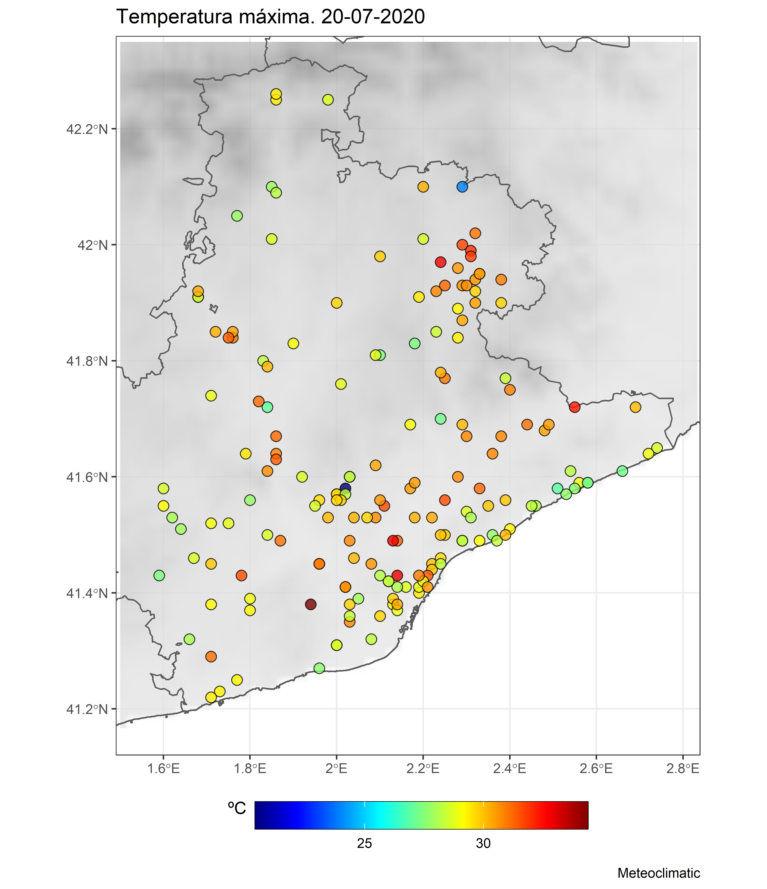
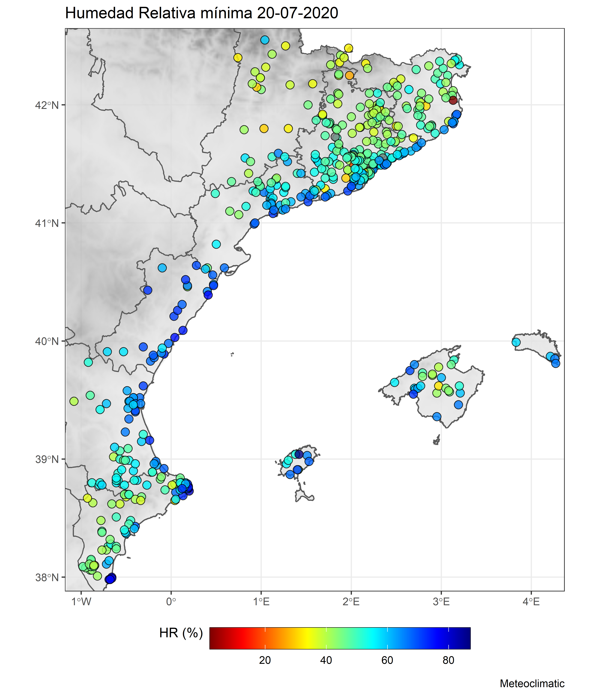

meteoclimaticR 
=========================================================
# `meteoclimaticR`: Descarga de datos de Meteoclimatic (https://www.meteoclimatic.net/)

## Descripción

**meteoclimaticR** permite la descarga de datos meteorológicos proporcionados por la red de Meteoclimatic. Se pueden obtener los datos actuales de temperatura, humedad relativa, precipitación, viento y presión atmosférica. Además también se pueden descargar los valores máximos y mínimos del mismo día. Como nota negativa, no se pueden bajar datos históricos, solamente los del presente día. 

## ¿Cómo funciona?

### Instalación

``` r
# Descarga desde github (0.0.1):
# install.packages("remotes")
remotes::install_github("lemuscanovas/meteoclimaticR")
```

### Ejemplo 1: una sola provincia

Para la descarga de datos de la **província de Barcelona**, usaremos la función `meteoclimatic_download`.  Para su funcionamiento es necesario escribir el **identificador** (`id_prov`) común para todas las estaciones de esta provincia. Este `id_prov` lo podemos obtener consultando cualquier estación de la provincia, por ejemplo Barcelona - Tibidabo (**ESCAT080000000**8023C). El texto en negrita hace referencia al identificador común de la provincia de Barcelona. **El identificador termina cuando aparece la primera cifra distinta a 0**


``` r
# Cargamos las librerías necesarias para el funcionamiento de la función:
if(!require("raster")) install.packages("raster")
if(!require("tidyverse")) install.packages("tidyverse")
if(!require("httr")) install.packages("httr")
if(!require("XML")) install.packages("XML")
if(!require("sf")) install.packages("sf")
if(!require("pals")) install.packages("pals")

library(meteoclimaticR)


# Descarga de los datos de temperatura máxima de la Provincia de Barcelona
bcn_met <- meteoclimatic_download(id_prov = "ESCAT080000000")
bcn_met
# # A tibble: 181 x 26
#    name  id      num mes     año hora    lat   lon Temp.unit Temp.act Temp.max Temp.min Hum.unit Hum.act Hum.max Hum.min Pres.unit Pres.act Pres.max
#    <chr> <chr> <dbl> <chr> <dbl> <chr> <dbl> <dbl> <chr>        <dbl>    <dbl>    <dbl> <chr>      <dbl>   <dbl>   <dbl> <chr>        <dbl>    <dbl>
#  1 Aigu~ ESCA~    20 Jul    2020 17:5~  41.8  2.25 C             26.5     31       15.3 %             65      91      37 hPa          1018.    1018 
#  2 Alel~ ESCA~    20 Jul    2020 18:0~  41.5  2.29 C             26.2     29.3     21.9 %             79      84      55 hPa          1017.    1018 
#  3 Alel~ ESCA~    20 Jul    2020 18:0~  41.5  2.29 C             23.9     28.1     21.6 %             83      84      57 hPa          1015     1015.
#  4 Aren~ ESCA~    20 Jul    2020 18:0~  41.6  2.56 C             25.6     29       20.9 %             81      82      65 hPa          1015.    1016.
#  5 Aren~ ESCA~    20 Jul    2020 18:0~  41.6  2.55 C             25.9     27.6     21.2 %             83      84      63 hPa          1016.    1017.
#  6 Aren~ ESCA~    20 Jul    2020 18:0~  41.6  2.54 C             25.4     28.2     20.7 %             72      74      48 hPa          1014.    1015.
#  7 Arge~ ESCA~    20 Jul    2020 18:0~  41.6  2.39 C             26.2     29.9     20.9 %             76      87      56 hPa          1014.    1014.
#  8 Bada~ ESCA~    20 Jul    2020 18:0~  41.5  2.24 C             26.7     28.7     22.4 %             72      80      66 hPa          1017.    1017 
#  9 Bada~ ESCA~    20 Jul    2020 18:0~  41.4  2.22 C             28.1     30       22.1 %             66      85      48 hPa          1017.    1018.
# 10 Bada~ ESCA~    20 Jul    2020 18:0~  41.4  2.22 C             28.8     29.9     22.7 %             61      79      47 hPa          1016.    1017.
# # ... with 171 more rows, and 7 more variables: Pres.min <dbl>, Vient.unit <chr>, Vient.act <dbl>, Vient.dir <dbl>, Vient.max <dbl>, Precip.unit <chr>,
# #   Precip.total <dbl>
```
A partir de estos datos y usando `ggplot2` es muy sencillo realizar un a visualización espacial de la variable de interés. Sin embargo, se ofrece la posibilidad de un mapeo automático con la función `plot_met`, la cual permite realizar la visualización de cualquiera de las varaibles mostradas en el objeto `bcn_met`. En esta ocasión vamos a plotear la temperatura máxima.
``` r
plot_met(bcn_met, title = "Temperatura máxima 20/07/2020", caption = "Meteoclimatic")
```

Dentro de plot_met se puede cambiar de paleta, tamaño de los puntos, etc... 

### Ejemplo 2: un conjunto de provincias

Para descargar varias provincias a la vez, simplemente hay que crear un vector con todos los identificadores deseados:
``` r
id_ppcc <- c("ESCAT08000000","ESCAT25000000","ESCAT17000000","ESCAT43000000", # cat
             "ESPVA12000000","ESPVA46000000","ESPVA030000000", #val
             "ESIBA0700000") #bal
```
Ahora simplemente se trata de usar la función `meteoclimatic_download` como en el ejemplo anterior. Note que la descarga puede demorar medio minuto.

``` r
# Descarga de los datos de temperatura máxima de la Provincia de Barcelona
ppcc_met <- meteoclimatic_download(id_prov = id_ppcc)
ppcc_met

# # A tibble: 523 x 26
#    name  id      num mes     año hora    lat   lon Temp.unit Temp.act Temp.max Temp.min Hum.unit Hum.act Hum.max Hum.min
#    <chr> <chr> <dbl> <chr> <dbl> <chr> <dbl> <dbl> <chr>        <dbl>    <dbl>    <dbl> <chr>      <dbl>   <dbl>   <dbl>
#  1 Aigu~ ESCA~    20 Jul    2020 20:2~  41.8  2.25 C             21.5     31       15.3 %             85      91      37
#  2 Alel~ ESCA~    20 Jul    2020 20:1~  41.5  2.29 C             24.2     29.3     21.9 %             82      84      55
#  3 Alel~ ESCA~    20 Jul    2020 20:1~  41.5  2.29 C             22.4     28.1     21.6 %             87      88      57
#  4 Aren~ ESCA~    20 Jul    2020 20:1~  41.6  2.56 C             23.9     29       20.9 %             85      85      65
#  5 Aren~ ESCA~    20 Jul    2020 20:1~  41.6  2.55 C             24.7     27.6     21.2 %             85      86      63
#  6 Aren~ ESCA~    20 Jul    2020 20:2~  41.6  2.54 C             23.8     28.2     20.7 %             74      74      48
#  7 Arge~ ESCA~    20 Jul    2020 20:1~  41.6  2.39 C             23.9     29.9     20.9 %             84      87      56
#  8 Bada~ ESCA~    20 Jul    2020 20:2~  41.5  2.24 C             25.2     29.6     22.4 %             77      80      66
#  9 Bada~ ESCA~    20 Jul    2020 20:1~  41.4  2.22 C             25.6     30       22.1 %             77      85      48
# 10 Bada~ ESCA~    20 Jul    2020 20:1~  41.4  2.22 C             26.2     29.9     22.7 %             71      79      47
# # ... with 513 more rows, and 10 more variables: Pres.unit <chr>, Pres.act <dbl>, Pres.max <dbl>, Pres.min <dbl>,
# #   Vient.unit <chr>, Vient.act <dbl>, Vient.dir <dbl>, Vient.max <dbl>, Precip.unit <chr>, Precip.total <dbl>```
```
Y ahora visualizamos:

``` r
plot_met(ppcc_met,var =  "Hum.min", title = "Humedad Relativa mínima 20-07-2020",
         caption = "Meteoclimatic",units = "HR (%)",pal = rev(pals::jet(100)))
```


