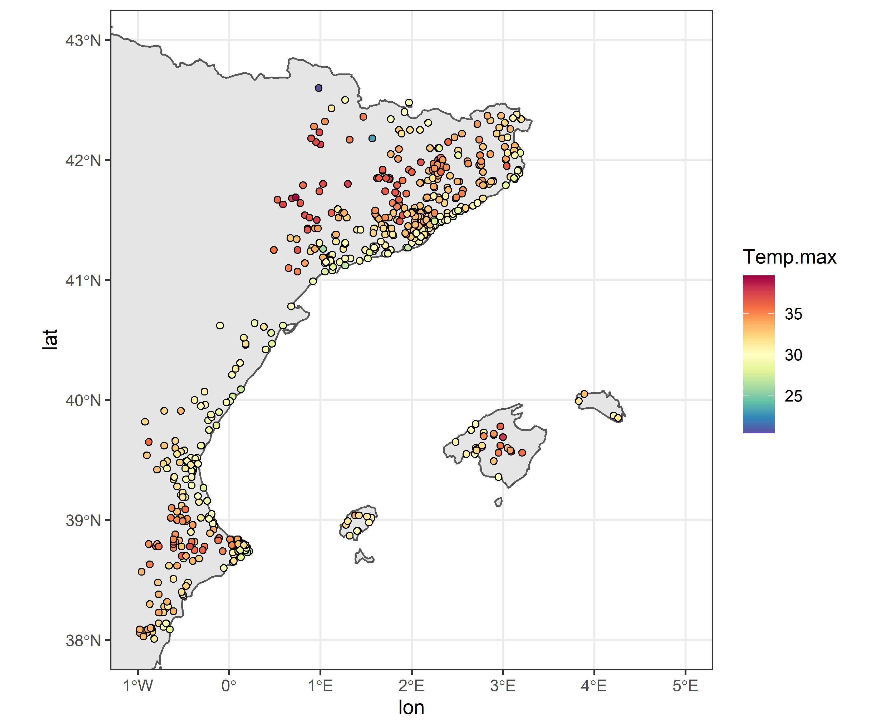
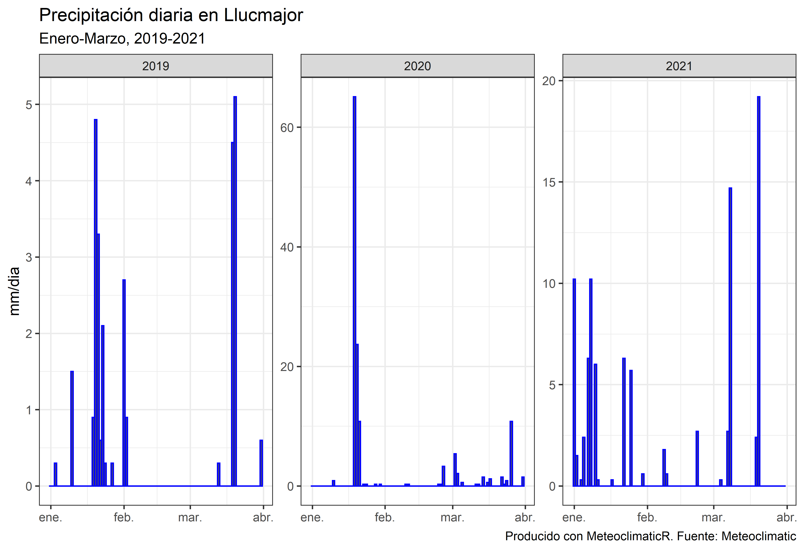
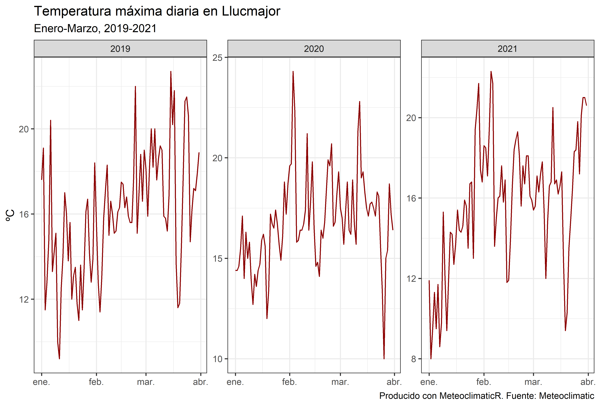

meteoclimaticR 
=========================================================
# `meteoclimaticR`: Descarga de datos de [Meteoclimatic](https://www.meteoclimatic.net/)

## Descripción

**meteoclimaticR** permite la descarga de datos meteorológicos proporcionados por la red de estaciones  Meteoclimatic. Se pueden obtener los datos actuales de temperatura, humedad relativa, precipitación, viento y presión atmosférica. Además también se pueden descargar los valores máximos y mínimos del mismo día. 
**Novedad de la última versión (21-07-2021)**: Descarga de los históricos diarios desde 2012 de forma masiva !!!

## ¿Cómo funciona?

### Instalación

``` r
# Descarga desde github (0.0.2):
# install.packages("remotes")
remotes::install_github("lemuscanovas/meteoclimaticR")
```

### 1. Descarga de los últimos registros meteorológicos

Para la descarga de los datos meterológicos más recientes existe la función `current_download`. Ésta tiene un funcionamento muy simple. Hay que especificar el `id` de la comunidad autónoma (CCAA), provincia o estación meteorológica que proporciona Meteoclimatic. Lógicamente, para los ids relativos a CCAA y provincias, se descargan todas las estaciones pertenecientes a la región solicitada.
Así, por ejemplo, si el usuario tienen interés en descargar los datos de la CCAA Illes Baleares, debe especificar: `id = ESIBA`; Si desea los datos de las estaciones de la isla de Mallorca, entonces `id = ESIBA07`. Para la estación concreta del Port de Sòller: `id = ESIBA0700000107108A`. Si, por ejemplo, se desean los datos de Catalunya, País Valencià e Illes Balears, se puede generar un simple vector: `id = c("ESCAT","ESPVA","ESIBA")`.
También es posible exportar directamente la descarga en un fichero excel especificando `save_excel = T`

Veámoslo en un ejemplo:

```r
library(meteoclimaticR)
ppcc <- current_download(id = c("ESCAT","ESPVA","ESIBA"),save = F)
ppcc

# A tibble: 6 x 26
#   name       id        num month    yr hour    lat   lon Temp.unit Temp.act
#   <chr>      <chr>   <dbl> <chr> <dbl> <chr> <dbl> <dbl> <chr>        <dbl>
# 1 Sant Mate~ ESIBA0~    21 Jul    2021 17:0~  39.0  1.38 C             30.8
# 2 Sant Miqu~ ESIBA0~    21 Jul    2021 17:0~  39.0  1.42 C             30.1
# 3 Santa Eul~ ESIBA0~    21 Jul    2021 17:0~  39.0  1.53 C             30.1
# 4 Son Ferri~ ESIBA0~    21 Jul    2021 17:0~  39.6  2.71 C             30.7
# 5 Vilafranc~ ESIBA0~    21 Jul    2021 17:0~  39.6  3.09 C             33.1
# 6 Vilafranc~ ESIBA0~    21 Jul    2021 17:0~  39.6  3.08 C             32.7
# # ... with 16 more variables: Temp.max <dbl>, Temp.min <dbl>,
# #   Hum.unit <chr>, Hum.act <dbl>, Hum.max <dbl>, Hum.min <dbl>,
# #   Pres.unit <chr>, Pres.act <dbl>, Pres.max <dbl>, Pres.min <dbl>,
# #   Vient.unit <chr>, Vient.act <dbl>, Vient.dir <dbl>, Vient.max <dbl>,
# #   Precip.unit <chr>, Precip.total <dbl>

```
Los datos están georreferenciados, por lo que es posible realizar una cartografía rápida de estos datos. A continuación un plot de la temperatura máxima:


```r 
library(sf)
library(ggplot2)
library(rnaturalearth)
library(pals)
spa <- ne_countries(country = "spain", scale = 10, returnclass = "sf")

ggplot()+
  geom_sf(data = spa)+
  geom_point(data = ppcc, aes(lon,lat, fill = Temp.max),
                              shape = 21, colour = "black")+
  scale_fill_gradientn(colours = rev(brewer.spectral(100)))+
  xlim(-1,5)+ylim(38,43)+
  theme_bw()
```


### 2. Descarga de datos históricos (desde 2012)

La descarga de datos históricos se realiza mediante la función `historical_download`. Ésta tiene un funcionamiento muy similar a la anterior, pero con la diferencia que **la descarga se debe realizar de forma masiva para toda la CCAA. Por lo tanto, no es posible realizar la descarga por provincia o por estación concreta**. De todos modos, es fácil realizar un filtraje de las estaciones desadas después de la descarga. 
A parte de los argumentos `id` y `save_excel`, en esta función es necesario especificar la fecha o el intervalo de fechas que se quiere descargar mediante el argumento `dates`. Por lo tanto hay dos opciones:
- Una sola fecha: `dates = "2017-01-05"`
- intervalo de fechas: `dates = c("2019-01-01","2020-05-30")`
Si se opta por un intervalo de fechas, el usuario puede filtrar solamente aquellos meses de su interés, por ejemplo los eneros del intervalo: `months = 1` (1 se refiere a Enero, 12 a Diciembre).
A continuación se muestra un ejemplo todo en uno para la CCAA Illes Balears:

```r 
bal_hist <- historical_download(id = "ESIBA",
                                dates = c("2019-01-01","2021-05-30"),
                                months = c(1:3),# solamente de enero hasta marzo 
                                save_excel = F) # recomendable T
                                
bal_hist

# A tibble: 6,134 x 14
#    name   id    time         lon   lat   alt Temp.max Temp.min Hum.max Hum.min Pres.max Pres.min
#    <chr>  <chr> <date>     <dbl> <dbl> <dbl>    <dbl>    <dbl>   <dbl>   <dbl>    <dbl>    <dbl>
#  1 Cala ~ ESIB~ 2019-01-01  1.28  39.0    12     17.7      5.7      94      64     1030     1028
#  2 Eivis~ ESIB~ 2019-01-01  1.32  38.9    27     17        8.3      92      61     1030     1028
#  3 Cala ~ ESIB~ 2019-01-01  3.89  40.0    65     15.5     10.9      94      76     1031     1028
#  4 Campa~ ESIB~ 2019-01-01  2.97  39.8   129     22.2     10.1      86      29     1031     1028
#  5 Ciuta~ ESIB~ 2019-01-01  3.83  40.0    16     15.6      9        91      73     1030     1027
#  6 Eivis~ ESIB~ 2019-01-01  1.41  38.9    27     17        8.3      92      61     1030     1028
#  7 Estel~ ESIB~ 2019-01-01  2.48  39.6   145     16.1      8.1      86      53     1032     1029
#  8 Inca ~ ESIB~ 2019-01-01  2.9   39.7   124     18.4      7.3      88      38     1030     1027
#  9 Inca ~ ESIB~ 2019-01-01  2.9   39.7   120     15.7      4.7      52      37     1027     1026
# 10 Llore~ ESIB~ 2019-01-01  2.97  39.6   166     18.7      6.1      83      40     1031     1027
# ... with 6,124 more rows, and 2 more variables: Vient.max <dbl>, Precip.diaria <dbl>        
```

Como se observa, la descarga tarda aproximadamente unos 5 minutos. Es recomendable guardar el fichero excel resultante `save_excel = T` si se quiere descargar una serie más larga, ya que la descarga podría demorarse bastante tiempo.

Mediante las funciones proporcionadas por la librería `dplyr`, es muy fácil filtrar la estación/es que se deseen. En este caso vamos a filtrar la estación de "Llucmajor" (ESIBA0700000107620A), en la isla de Mallorca. Con `lubridate` y `ggplot`, uno puede representar la serie diaria de precipitación o tempratura máxima para cada uno de los años descargados.

```r 
library(dplyr)
library(lubridate)

# Filtraje de la estación en cuestión:
llucmajor <- bal_hist %>% filter(id == "ESIBA0700000107620A")

# Visualización de la precipitación diaria.
ggplot(llucmajor, aes(x = time, y = Precip.diaria))+
  geom_col(color = "blue")+
  facet_wrap(~year(time), scales = "free")+
  ylab("mm/dia")+
  labs(title = "Precipitación diaria en Llucmajor",
       subtitle = "Enero-Marzo, 2019-2021",
       caption = "Producido con MeteoclimaticR. Fuente: Meteoclimatic")+
  theme_bw()+
  theme(axis.title.x = element_blank())
  
# Visualización de la tempreratura máxima diaria.
ggplot(llucmajor, aes(x = time, y = Temp.max))+
  geom_line(color = "darkred")+
  facet_wrap(~year(time), scales = "free")+
  ylab("ºC")+
  labs(title = "Temperatura máxima diaria en Llucmajor",
       subtitle = "Enero-Marzo, 2019-2021",
       caption = "Producido con MeteoclimaticR. Fuente: Meteoclimatic")+
  theme_bw()+
  theme(axis.title.x = element_blank())
  
```




### Apéndice: Los códigos de todas las provincias.

Finalmente, se muestra el vector para todas las provincias de la Península:
``` r
id_prov <- c("ESCAT08000000","ESCAT25000000","ESCAT17000000","ESCAT43000000", # cat
             "ESPVA12000000","ESPVA46000000","ESPVA030000000", #val
             "ESMUR30000000", # mur
             "ESAND040000000","ESAND18000000","ESAND23000000","ESAND14000000","ESAND29000000",
             "ESAND41000000","ESAND1100000011600A","ESAND21000000", # and
             "PTSUR080000000","PTSUR120000000","PTCEN110000000",
             "PTCEN200000000","PTCEN100000000","PTNOR040000000","PTNOR180000000", # pt
             "ESEXT060000000","ESEXT10000000", #ext
             "ESCLM45000000","ESCLM13000000","ESCLM16000000","ESCLM020000000",
             "ESCLM19000000", #cylam
             "ESMAD28000000", #mad
             "ESCYL0500000005","ESCYL40000000","ESCYL42000000","ESCYL42000000",
             "ESCYL34000000","ESCYL24000000","ESCYL49000000","ESCYL47000000",
             "ESCYL37000000","ESCYL49000000", #cyleo
             "ESGAL320000000","ESGAL36000000","ESGAL15000000","ESGAL27000000", # gal
             "ESAST33000000", #astu
             "ESCTB39000000" ,#cant
             "ESEUS48000000","ESEUS20000000","ESEUS010000000", #eusk
             "ESNAF31000000", #nav,
             "ESLRI26000000", #rioj
             "ESARA22000000","ESARA50000000","ESARA44000000", #arag
             "ESIBA0700000","ESAND52000000")#"ESICA3800000") # bal, melilla y canarias
```
Para cualquier cuestión no dudes en contactarme: mlemus@ub.edu
